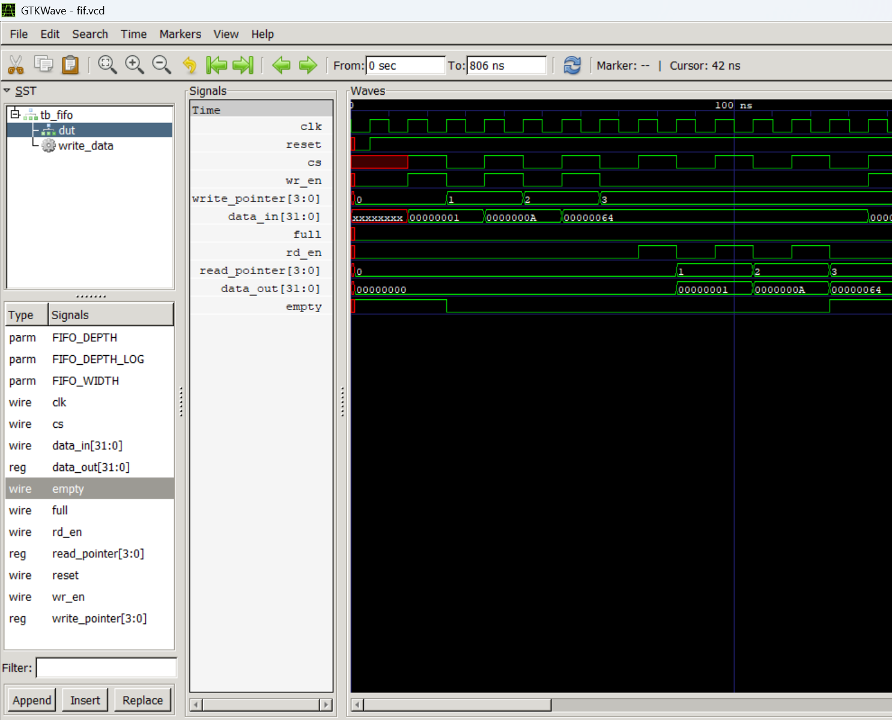
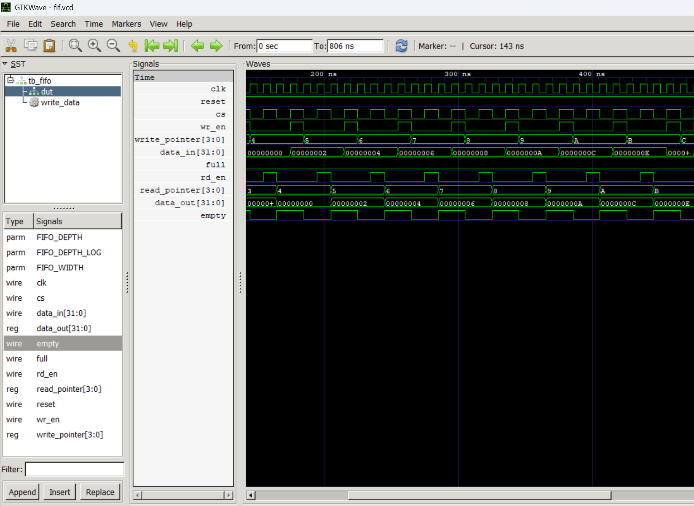
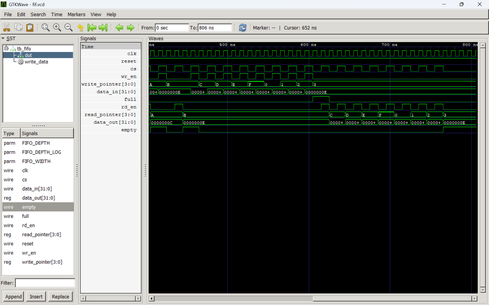
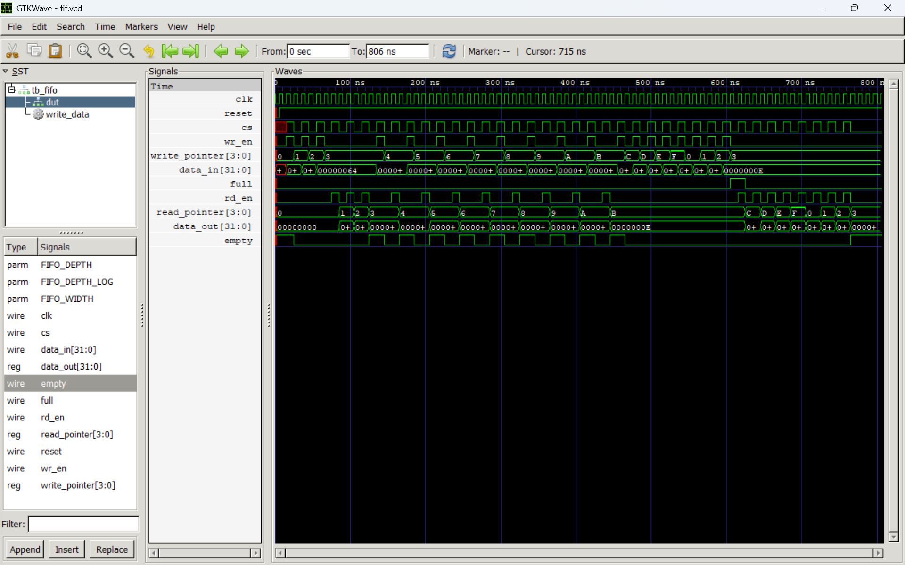

# Synchronous FIFO (First-In-First-Out)

## What is this?
This project is a Synchronous FIFO built for real chip design. A FIFO is a memory buffer that safely passes data between two parts of a chip that share the same clock. 

This design uses a clever trick: it adds one extra bit to the read and write pointers to figure out if the FIFO is `full` or `empty`. This saves chip space because we do not need to build a separate counter.

## Folder Structure
*   **`rtl/`**: Contains the main Verilog design code (`fifo.v`).
*   **`tb/`**: Contains the testbench code used for checking errors (`tb_fifo.v`).
*   **`img/`**: Contains screenshots of the simulation waveforms.

## Important Design Choice: Separate `always` Blocks
To make sure the design software builds a fast and small chip, the pointer code and the memory code are kept in separate `always` blocks. Here is why:

*   **Pointers (With Reset)**
    *   **Becomes:** Standard **D-Flip-Flops (DFFs)**.
    *   **Why:** Pointers are small registers. Standard DFFs in a chip have dedicated reset pins. Using an `always` block with a `reset` tells the tool to use these standard cells so the pointers start at 0 when the chip turns on.
*   **Memory Array (Without Reset)**
    *   **Becomes:** Large memory blocks like **SRAM** (in chips) or **Block RAM** (in FPGAs).
    *   **Why:** Real block memory does not have reset pins for every single bit, because that would waste too much wiring and power. By keeping the `reset` out of the memory `always` block, the tool knows to use a proper, space-saving SRAM block. If we included a reset, the tool would panic and build the memory out of thousands of tiny DFFs instead. That would ruin the chip's size and speed.

## Testing and Results
The testbench (`tb_fifo.v`) tests the code to make sure it works perfectly. Below are the waveform screenshots from the tests:

### Scenario 1: Basic Write and Read
*(Checks simple writes followed by reads to make sure data is not lost)*

### Scenario 2: Interleaved Write and Read
*(Checks what happens when reading and writing happen at the exact same time)*

### Scenario 3: Fill to Depth, then Empty
*(Checks the `full` and `empty` limits by filling the FIFO all the way to the top, and then draining it completely)*

### Overall Simulation

